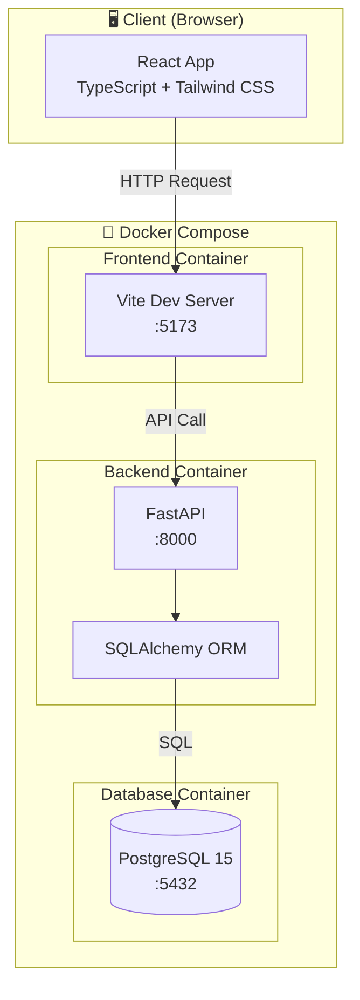
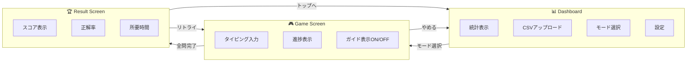
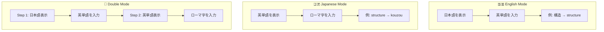
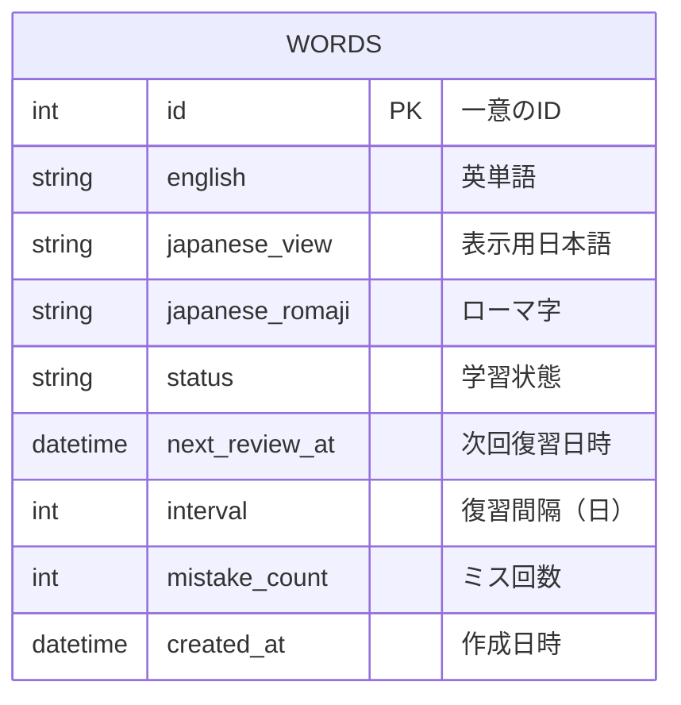
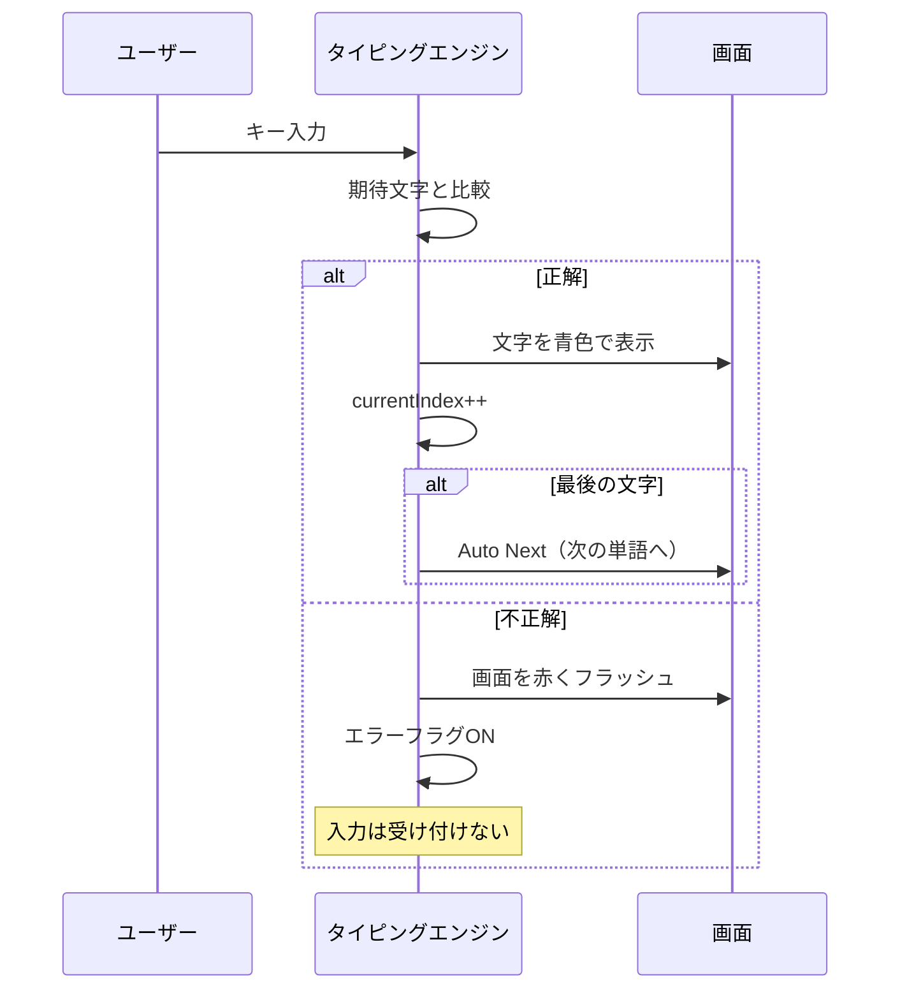
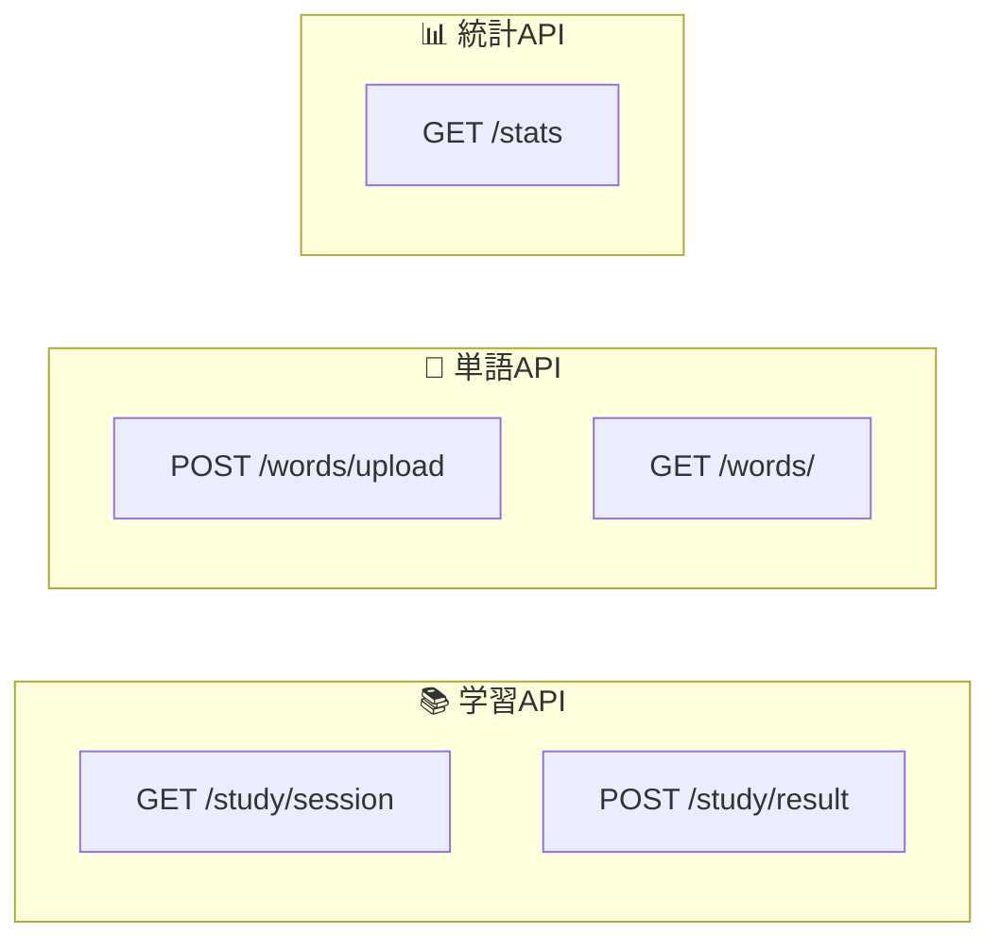
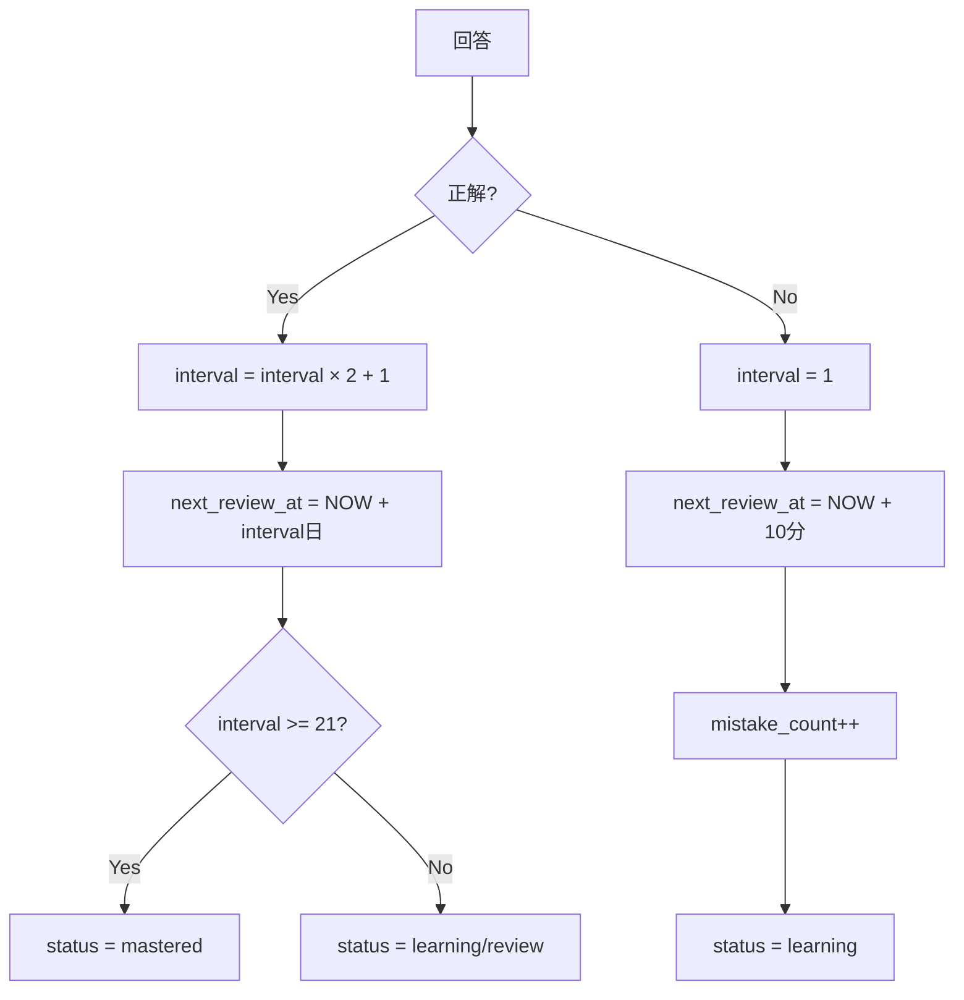

# 🎯 TOEIC Typing Memorizer

TOEIC 頻出単語を「**Anki（分散学習）**」と「**タイピング（運動記憶）**」を組み合わせて効率的に暗記する Web アプリケーション。

「**e-typing**」のようなテンポの良い入力体験と、「**Anki**」の復習アルゴリズムを融合。


---

## 📸 デモ

> ※ スクリーンショットを追加予定

---

## 🏗️ システムアーキテクチャ



---

## 🔄 画面遷移フロー



---

## 🎮 ゲームモード詳細



---

## 🗄️ データベース設計



### 学習ステータス

| Status     | 説明         |
| ---------- | ------------ |
| `new`      | 未学習       |
| `learning` | 学習中       |
| `review`   | 復習待ち     |
| `mastered` | マスター済み |

---

## ⚡ タイピングエンジン仕様



### 特徴

- **Character-by-Character 判定**: 1 文字ずつリアルタイム判定
- **Auto Next**: 最後の文字入力で自動的に次へ（Enter キー不要）
- **エラー時**: 不正解文字は入力されず、画面が一瞬赤くなる

---

## 📡 API エンドポイント



| Method | Endpoint         | 説明                       |
| ------ | ---------------- | -------------------------- |
| `GET`  | `/study/session` | 学習セッション用の単語取得 |
| `POST` | `/study/result`  | 学習結果の送信             |
| `POST` | `/words/upload`  | CSV アップロード           |
| `GET`  | `/words/`        | 全単語取得                 |
| `GET`  | `/stats`         | 統計情報取得               |

---

## 🔁 Anki アルゴリズム（簡易版）



---

## 🚀 クイックスタート

### 必要要件

- Docker
- Docker Compose

### 起動方法

```bash
# リポジトリをクローン
git clone https://github.com/yourusername/anki-typing.git
cd anki-typing

# Docker Composeで起動
docker compose up --build

# バックグラウンドで起動する場合
docker compose up -d --build
```

### アクセス URL

| サービス              | URL                        |
| --------------------- | -------------------------- |
| フロントエンド        | http://localhost:5173      |
| バックエンド API Docs | http://localhost:8000/docs |

---

## 📝 使い方

1. ブラウザで http://localhost:5173 を開く
2. CSV ファイルをアップロード（`sample_words.csv` を使用可能）
3. ⚙️ 設定でガイド表示の ON/OFF を選択
4. ゲームモードを選択して開始
5. **IME は OFF にして直接入力モードでプレイ**

---

## 📁 CSV フォーマット

```csv
english,japanese_view,japanese_romaji
structure,構造,kouzou
schedule,予定,yotei
implement,実装する,jissousuru
```

| カラム            | 説明               |
| ----------------- | ------------------ |
| `english`         | 英単語             |
| `japanese_view`   | 表示用日本語       |
| `japanese_romaji` | ローマ字入力判定用 |

---

## 📂 ディレクトリ構成

```
anki-typing/
├── 📄 docker-compose.yml     # Docker Compose設定
├── 📄 .gitignore
├── 📄 README.md
├── 📄 sample_words.csv       # サンプル単語データ
│
├── 📁 backend/               # FastAPI バックエンド
│   ├── Dockerfile
│   ├── requirements.txt
│   ├── main.py              # エントリーポイント
│   ├── database.py          # DB接続設定
│   ├── models.py            # SQLAlchemyモデル
│   ├── schemas.py           # Pydanticスキーマ
│   ├── crud.py              # DB操作
│   └── routers/
│       ├── study.py         # 学習API
│       ├── words.py         # 単語API
│       └── stats.py         # 統計API
│
└── 📁 frontend/              # React フロントエンド
    ├── Dockerfile
    ├── package.json
    ├── vite.config.ts
    ├── tailwind.config.js
    ├── tsconfig.json
    └── src/
        ├── main.tsx
        ├── App.tsx
        ├── index.css
        ├── types/           # TypeScript型定義
        │   └── index.ts
        ├── hooks/           # カスタムフック
        │   ├── useTypingEngine.ts  # タイピングエンジン
        │   ├── useApi.ts
        │   └── index.ts
        ├── components/      # UIコンポーネント
        │   ├── TypingDisplay.tsx
        │   ├── StatsCard.tsx
        │   ├── CSVUploader.tsx
        │   ├── ModeSelect.tsx
        │   ├── GameHeader.tsx
        │   └── index.ts
        └── pages/           # ページコンポーネント
            ├── Dashboard.tsx
            ├── Game.tsx
            ├── Result.tsx
            └── index.ts
```

---

## 🛠️ 技術スタック

### Frontend

- **React 18** - UI ライブラリ
- **TypeScript** - 型安全な開発
- **Vite** - 高速ビルドツール
- **Tailwind CSS** - ユーティリティファースト CSS
- **React Router** - ルーティング

### Backend

- **Python 3.11** - プログラミング言語
- **FastAPI** - 高速 API フレームワーク
- **SQLAlchemy** - ORM
- **Pydantic** - データバリデーション

### Infrastructure

- **PostgreSQL 15** - データベース
- **Docker Compose** - コンテナオーケストレーション

---

## 🔧 開発

### ローカル開発（Docker 外）

```bash
# バックエンド
cd backend
pip install -r requirements.txt
uvicorn main:app --reload

# フロントエンド
cd frontend
npm install
npm run dev
```

### コンテナ操作

```bash
# 起動
docker compose up -d

# 停止
docker compose down

# ログ確認
docker compose logs -f

# 再ビルド
docker compose up -d --build
```

---

## 📄 ライセンス

MIT License

---

## 🤝 コントリビューション

プルリクエスト歓迎です！
